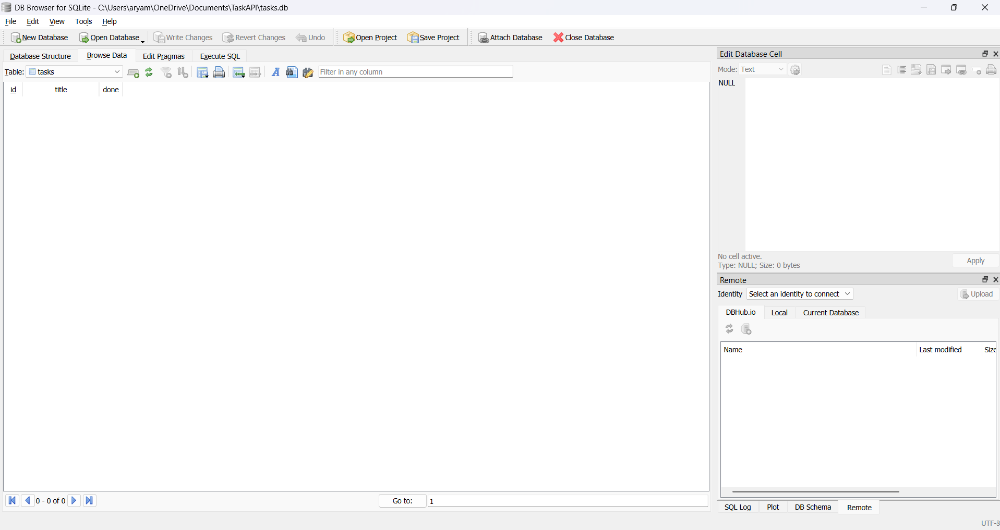

# Task API - SQLite CRUD API

A simple CRUD (Create, Read, Update, Delete) REST API built using **FastAPI** and **SQLite**. This project demonstrates how to replace an in-memory data store with a persistent SQLite database while keeping the API endpoints unchanged.

---

## Features

- Create new tasks
- Retrieve all tasks
- Retrieve a task by ID
- Update existing tasks
- Delete tasks
- SQLite database persistence
- Automatic database and table creation
- Automatic seeding of sample tasks on first run
- Input validation with proper HTTP status codes
- Interactive API documentation using Swagger UI

---

## Technologies Used

- Python 3.11+
- FastAPI
- SQLite (sqlite3)
- Uvicorn

---

## Why SQLite?

SQLite was chosen because:

- It is lightweight and serverless.
- No separate database installation is required.
- The database is stored in a single file (`tasks.db`).
- Data persists even after restarting the application.
- Perfect for small backend applications and learning SQL.

---

## Database

The application automatically creates:

```
tasks.db
```

on the first run.

It also automatically creates the `tasks` table if it does not exist and inserts three sample tasks only when the table is empty.

Table structure:

| Column | Type |
|---------|------|
| id | INTEGER PRIMARY KEY AUTOINCREMENT |
| title | TEXT |
| done | BOOLEAN |

---

## Project Structure

```
TaskAPI/
│
├── images/
│   ├── swagger-ui.png
│   └── database-viewer.png
│
├── main.py
├── requirements.txt
├── tasks.db
├── README.md
└── .gitignore
```

---

## Installation

Clone the repository

```bash
git clone <repository-url>
cd TaskAPI
```

Install dependencies

```bash
pip install -r requirements.txt
```

Run the application

```bash
uvicorn main:app --reload
```

Open Swagger UI

```
http://127.0.0.1:8000/docs
```

---

## API Endpoints

| Method | Endpoint | Description |
|---------|----------|-------------|
| GET | /tasks | Get all tasks |
| GET | /tasks/{id} | Get a task by ID |
| POST | /tasks | Create a new task |
| PUT | /tasks/{id} | Update a task |
| DELETE | /tasks/{id} | Delete a task |

---

## Example SQL Queries

List every task

```sql
SELECT * FROM tasks;
```

Show completed tasks

```sql
SELECT * FROM tasks WHERE done = 1;
```

Count all tasks

```sql
SELECT COUNT(*) FROM tasks;
```

Mark all tasks as completed

```sql
UPDATE tasks SET done = 1;
```

Delete completed tasks

```sql
DELETE FROM tasks WHERE done = 1;
```

---

## API Screenshot


---

## Database Screenshot




---

## HTTP Status Codes

| Status Code | Meaning |
|-------------|---------|
| 200 | Success |
| 201 | Task Created |
| 204 | Task Deleted |
| 400 | Invalid Request |
| 404 | Task Not Found |

---

## Sample Response

```json
[
  {
    "id": 1,
    "title": "Learn FastAPI",
    "done": false
  },
  {
    "id": 2,
    "title": "Build CRUD API",
    "done": false
  },
  {
    "id": 3,
    "title": "Push to GitHub",
    "done": false
  }
]
```

---

## Author

Aryaman Dutta

Backend Development Internship - FlyRank