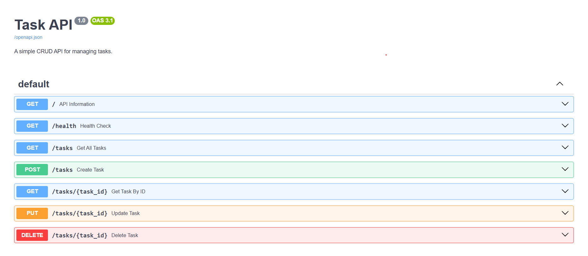

# Task API

A simple RESTful CRUD API built with **FastAPI** for managing tasks. This project demonstrates the implementation of Create, Read, Update, and Delete operations using an in-memory data store, along with request validation, proper HTTP status codes, and automatically generated API documentation via Swagger UI.

---

## Features

- Create a new task
- Retrieve all tasks
- Retrieve a specific task by ID
- Update an existing task
- Delete a task
- Request body validation
- Appropriate HTTP status codes
- Interactive Swagger documentation

---

## Tech Stack

- Python 3
- FastAPI
- Pydantic
- Uvicorn

---

## Project Structure

```
task-api/
│── main.py
│── requirements.txt
│── README.md
└── .gitignore
```

---

## Installation

### 1. Clone the repository

```bash
git clone https://github.com/<your-username>/task-api.git
cd task-api
```

### 2. Install dependencies

```bash
pip install -r requirements.txt
```

### 3. Start the server

```bash
uvicorn main:app --reload
```

The server will start at:

```
http://127.0.0.1:8000
```

---

## API Documentation

FastAPI automatically generates interactive API documentation.

Open your browser and visit:

```
http://127.0.0.1:8000/docs
```

You can test every endpoint directly from Swagger UI.

---

## API Endpoints

| Method | Endpoint | Description |
| :----: | :------: | ----------- |
| GET | `/` | API information |
| GET | `/health` | Health check |
| GET | `/tasks` | Retrieve all tasks |
| GET | `/tasks/{id}` | Retrieve a task by ID |
| POST | `/tasks` | Create a new task |
| PUT | `/tasks/{id}` | Update an existing task |
| DELETE | `/tasks/{id}` | Delete a task |

---

## Example Request

### Create a Task

```http
POST /tasks
Content-Type: application/json
```

```json
{
    "title": "Learn FastAPI"
}
```

### Response

```json
{
    "id": 4,
    "title": "Learn FastAPI",
    "done": false
}
```

---

## HTTP Status Codes

| Code | Meaning |
| :--: | ------- |
| 200 | Successful request |
| 201 | Resource created |
| 204 | Resource deleted successfully |
| 400 | Invalid request body |
| 404 | Task not found |

---

## Swagger UI

### Interactive API Documentation




---

## Author

**Aryaman Dutta**

GitHub: https://github.com/aryamanDutta